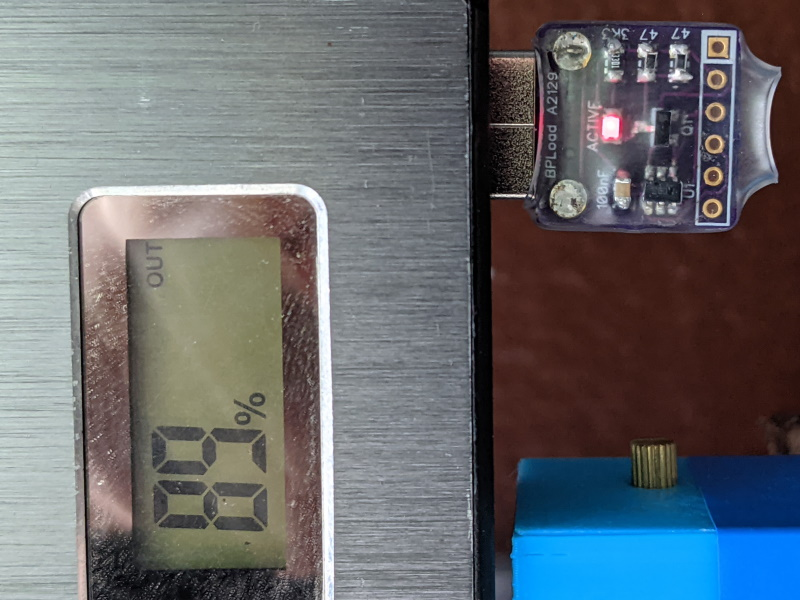

# Battery Pack Load

The only task this device has is to load USB every 10 seconds with about 200 mA
for 20 ms in order to give the battery pack a reason to live.

This device will pulse load every 10 seconds thus having 0.2% duty cycle for an
average consumption of about 0.5 mA (depending on the PIC used).

There is a simpler version that doesn't use microcontroller available at
[Dorkbot PDX](https://dorkbotpdx.org/blog/paul/battery_pack_load/) but I love
to complicate things.

---

See also:
* [Plug version](Hardware/src/BatteryPackLoad.md)
* [Pass-through version](Hardware/src/BatteryPackLoad-PT.md)
* [Blog post](https://www.medo64.com/2021/08/battery-pack-load/)
* [Repository](https://github.com/medo64/BatteryPackLoad)

